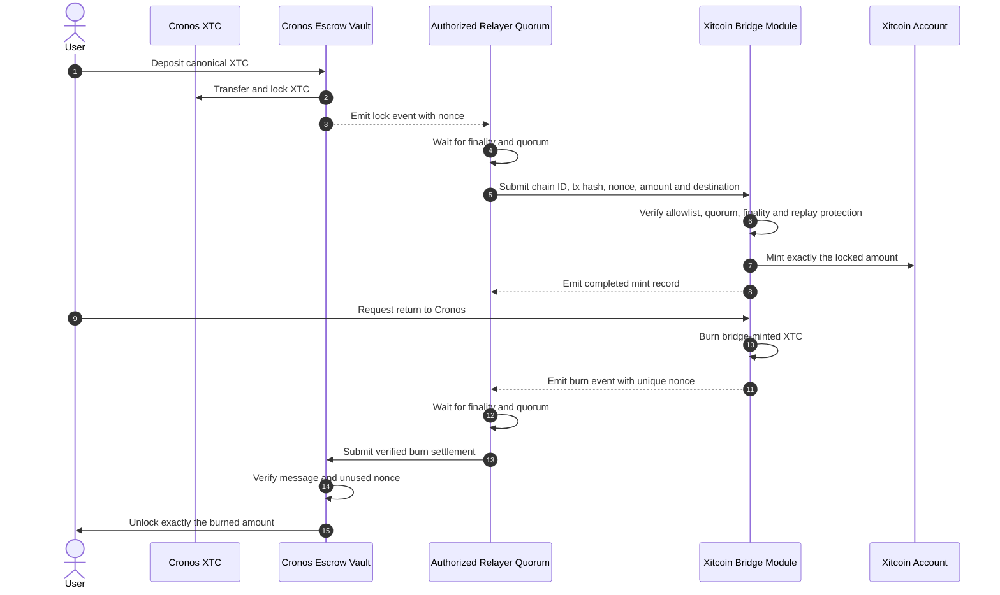
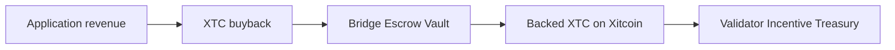

# Bridge architecture

The planned canonical bridge connects XTC on Cronos with native XTC on the Xitcoin network. Both representations use the public symbol `XTC`; their identity is determined by the network, chain ID and canonical contract or denomination.

The bridge preserves auditable one-to-one accounting while value is locked, represented and returned.

The diagrams describe the intended settlement flow. Destination submission is
not activated; see [implementation and activation status](status-and-security.md).

## Bridge lifecycle at a glance

```mermaid
flowchart LR
    U1["User on Cronos"] -->|"Deposit XTC"| V["Cronos Bridge Escrow Vault"]
    V -->|"Lock finalized"| Q["Relayer quorum and finality verification"]
    Q -->|"Unique authorized message"| M["Xitcoin Bridge Module"]
    M -->|"Strictly backed mint 1:1"| U2["User on Xitcoin EVM / POS"]

    U2 -->|"Return request"| B["Burn bridge-minted XTC"]
    B -->|"Burn finalized"| Q2["Relayer quorum and replay verification"]
    Q2 -->|"Unique authorized message"| V
    V -->|"Unlock original XTC"| U1
```



The forward path changes the network representation of XTC without increasing global economic supply. The return path burns the bridge-minted XTC before releasing the original Cronos XTC.

## Technical settlement sequence



## Cronos to Xitcoin: lock and strictly backed mint

1. A user deposits canonical Cronos `XTC` into the approved bridge contract.
2. The Cronos-side contract locks the deposited amount.
3. Relayers observe the event and wait for the required finality.
4. The Xitcoin-side bridge verifies the authorized message and replay protection.
5. The corresponding native XTC amount is minted to the destination address.
6. Public accounting records the one-to-one relationship between Cronos `XTC` locked and native XTC minted through the bridge.

## Xitcoin to Cronos: bridge burn and unlock

1. A user submits native XTC to the Xitcoin-side bridge.
2. The corresponding bridge-minted native XTC amount is burned on Xitcoin.
3. Relayers observe finality and submit the authorized message to Cronos.
4. The Cronos bridge releases the corresponding locked XTC.
5. Transaction identifiers on both networks provide an auditable trail.

## Application revenue pathway

The bridge burn used for a return is an accounting operation: it cancels the Xitcoin representation before the same value is unlocked on Cronos. It does not reduce the global economic supply.

A permanent burn of canonical `XTC` on Cronos is different. It reduces the effective global XTC ceiling and must be recorded in a public burn ledger. The corresponding unused Xitcoin bridge capacity must be reduced by the same amount. Cronos `XTC` backing an active Xitcoin representation must never be permanently burned unless the corresponding Xitcoin amount is retired first.

Buyback XTC must have one exclusive destination: reward funding, bridge backing or permanent burn. The same XTC cannot be counted in more than one destination.

The bridge may also support verified transfers from application-funded buyback and revenue-sharing mechanisms.



Only the authorized Xitcoin bridge module may perform this strictly backed mint. Applications and relayers receive no mint authority. Every XTC minted through the bridge must remain covered one-to-one by canonical XTC locked on Cronos.

The full planned reward loop, distribution ceilings and security boundary are documented under [Validator incentives and revenue flywheel](../staking/validator-incentives.md).

## User experience

A public bridge interface should make five facts explicit before confirmation:

* source network;
* destination network;
* amount and fees;
* destination address;
* expected confirmation state.

Users should not need to understand internal supply representations to use the bridge safely. Technical accounting remains documented for auditors, integrators and operators.

## Required invariants

At all times, the system must preserve measurable relationships between:

* `XTC` locked on Cronos;
* bridge-authorized native XTC issued on Xitcoin;
* bridge-minted native XTC burned for return;
* XTC unlocked back on Cronos.

The fundamental bridge invariant is:

```
active bridge-minted XTC on Xitcoin
= canonical XTC locked in the Cronos Bridge Escrow Vault
```

Bridge administration must not provide an unrestricted public issuance path. The canonical Cronos `XTC` token must not receive new mint authority for bridge operation.

## Security controls

* explicit chain and contract allowlists;
* finality thresholds on both networks;
* message uniqueness and replay protection;
* amount and rate limits;
* emergency pause with auditable authority;
* monitored relayer quorum;
* contract and relayer version control;
* reconciliation alerts;
* tested recovery and incident procedures.


This is the planned architecture. The bridge is not presented as active until contracts, relayers, accounting and public interfaces have passed final validation.

