# Sovereign Participation Reference 2026

This publication defines a deterministic technical reference for potential institutional participation in the Xitcoin validator network. It standardizes allocation calculations, eligibility requirements and operational continuity. It does not confer asset ownership, validator appointment, legal status, diplomatic recognition, endorsement or automatic access.


**Protocol neutrality.** Xitcoin is general-purpose digital infrastructure. Like electricity and communications networks, it operates through common technical rules that do not depend on political alignment. A statistical reference in this index has no diplomatic, legal or political effect.


The methodology covers **193 reserved positions**, corresponding to the United Nations Member States recorded at the 2026 reference date.

## Fixed reference envelope

| Component | Quantity | Weight |
|---|---:|---:|
| Equal component | 289 500 000 XTC | 75% |
| Demographic component | 96 500 000 XTC | 25% |
| Total | **386 000 000 XTC** | 100% |

Every position starts with the same **1 500 000 XTC** base.

## Allocation formula

Before rounding to integer XTC, the reference quantity for position $i$ is:

$A_i = 386{,}000{,}000 \left( \frac{0.75}{193} + 0.25 \frac{\sqrt{P_i}}{\sum_{j=1}^{193}\sqrt{P_j}} \right)$

Here, $P_i$ is the consolidated population reference for 1 July 2026.

The square-root function recognizes population differences while limiting concentration: four times the population produces twice the demographic weight, rather than four times the weight.

## Neutrality and equal treatment

The methodology uses only two components: an identical base and a pinned population reference. It does not use:

- gross domestic product, national wealth or market size;
- land area, natural resources or military capacity;
- political alignment, diplomatic influence or institutional seniority;
- current XTC holdings, investment size or ability to purchase tokens;
- discretionary scoring by the Xitcoin operator.

Because 75% of the envelope is equal, every reference receives the same 1 500 000 XTC base. Only 25% varies, and the square-root transformation deliberately compresses population differences. The same source, date, formula, precision and rounding rule apply to all 193 references.

## Integer allocation and rounding

The published allocation table uses integer XTC only:

1. calculate every exact result with deterministic decimal arithmetic;
2. take its integer floor;
3. rank fractional remainders from largest to smallest;
4. distribute the remaining XTC in that order;
5. use ascending ISO3 code to resolve an exact tie.

The 193 floors total **385,999,899 XTC**. The method distributes the remaining **101 XTC**, producing exactly **386,000,000 XTC**.

## Population source

- United Nations World Population Prospects 2024;
- medium variant;
- reference date: **1 July 2026**;
- source SHA-256: `98e34d9b65b53858cd08a57a566e45050b08093ad85ba5714fe6fbd78055ae6d`.

## Statistical treatment

Population inputs follow the United Nations World Population Prospects dataset
and the United Nations M49 statistical framework. Statistical records do not
create additional validator positions.

For the China calculation, the source data for China, Hong Kong SAR, Macao SAR
and Taiwan Province of China are consolidated into the single China reference.
This is a reproducible statistical treatment inherited from the cited United
Nations framework; it is not a political or diplomatic determination by
Xitcoin.

The complete 39-record consolidation mapping is maintained with the blockchain
source in
`networks/testnet/territorial-consolidation-2026.csv`.

## Complete Xitcoin Sovereign Reference Index 2026

The first column displays locally hosted reference flags for navigation. They are non-authoritative and do not affect identity, eligibility or quantity. United Nations M49 and ISO identifiers remain canonical.

| Reference flag | Sovereign reference | ISO3 | 2026 reference population | Equal component | Demographic component | 2026 reference quantity |
|---|---|---:|---:|---:|---:|---:|
|  | Afghanistan | `AFG` | 45 047 069 | 1 500 000 XTC | 776 974 XTC | **2 276 974 XTC** |
|  | Albania | `ALB` | 2 751 025 | 1 500 000 XTC | 192 008 XTC | **1 692 008 XTC** |
| 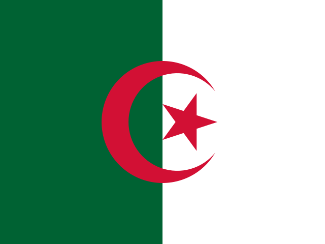 | Algeria | `DZA` | 48 028 334 | 1 500 000 XTC | 802 272 XTC | **2 302 272 XTC** |
| 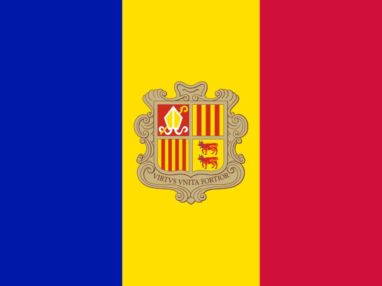 | Andorra | `AND` | 83 753 | 1 500 000 XTC | 33 502 XTC | **1 533 502 XTC** |
|  | Angola | `AGO` | 40 215 179 | 1 500 000 XTC | 734 122 XTC | **2 234 122 XTC** |
| 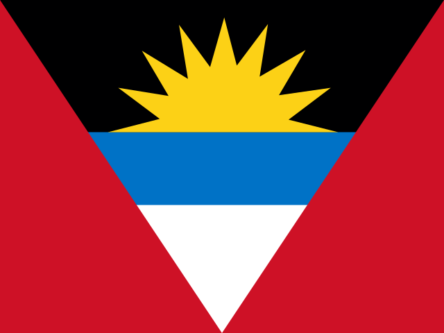 | Antigua and Barbuda | `ATG` | 94 626 | 1 500 000 XTC | 35 611 XTC | **1 535 611 XTC** |
|  | Argentina | `ARG` | 46 003 734 | 1 500 000 XTC | 785 181 XTC | **2 285 181 XTC** |
|  | Armenia | `ARM` | 2 930 915 | 1 500 000 XTC | 198 187 XTC | **1 698 187 XTC** |
|  | Australia | `AUS` | 27 227 096 | 1 500 000 XTC | 604 051 XTC | **2 104 051 XTC** |
|  | Austria | `AUT` | 9 107 266 | 1 500 000 XTC | 349 355 XTC | **1 849 355 XTC** |
|  | Azerbaijan | `AZE` | 10 454 855 | 1 500 000 XTC | 374 311 XTC | **1 874 311 XTC** |
| 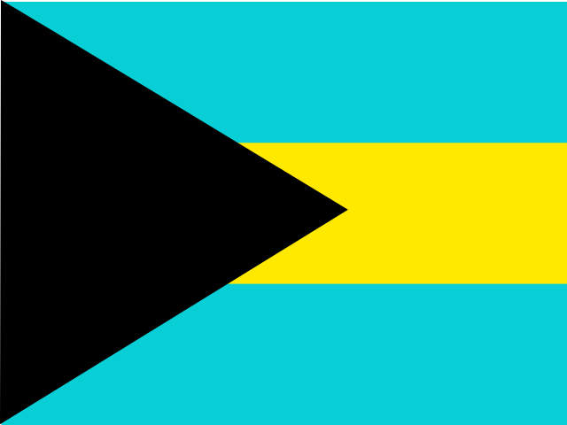 | Bahamas | `BHS` | 404 628 | 1 500 000 XTC | 73 638 XTC | **1 573 638 XTC** |
|  | Bahrain | `BHR` | 1 675 572 | 1 500 000 XTC | 149 849 XTC | **1 649 849 XTC** |
|  | Bangladesh | `BGD` | 177 818 044 | 1 500 000 XTC | 1 543 693 XTC | **3 043 693 XTC** |
|  | Barbados | `BRB` | 282 724 | 1 500 000 XTC | 61 554 XTC | **1 561 554 XTC** |
| 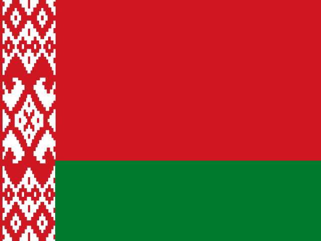 | Belarus | `BLR` | 8 937 018 | 1 500 000 XTC | 346 074 XTC | **1 846 074 XTC** |
|  | Belgium | `BEL` | 11 774 642 | 1 500 000 XTC | 397 235 XTC | **1 897 235 XTC** |
|  | Belize | `BLZ` | 428 644 | 1 500 000 XTC | 75 792 XTC | **1 575 792 XTC** |
|  | Benin | `BEN` | 15 170 419 | 1 500 000 XTC | 450 891 XTC | **1 950 891 XTC** |
| 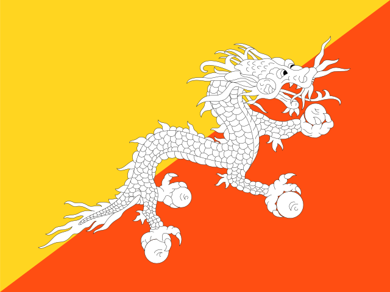 | Bhutan | `BTN` | 802 214 | 1 500 000 XTC | 103 686 XTC | **1 603 686 XTC** |
|  | Bolivia (Plurinational State of) | `BOL` | 12 749 291 | 1 500 000 XTC | 413 348 XTC | **1 913 348 XTC** |
|  | Bosnia and Herzegovina | `BIH` | 3 114 242 | 1 500 000 XTC | 204 291 XTC | **1 704 291 XTC** |
|  | Botswana | `BWA` | 2 603 388 | 1 500 000 XTC | 186 785 XTC | **1 686 785 XTC** |
|  | Brazil | `BRA` | 213 562 666 | 1 500 000 XTC | 1 691 749 XTC | **3 191 749 XTC** |
|  | Brunei Darussalam | `BRN` | 469 775 | 1 500 000 XTC | 79 345 XTC | **1 579 345 XTC** |
|  | Bulgaria | `BGR` | 6 667 659 | 1 500 000 XTC | 298 923 XTC | **1 798 923 XTC** |
| 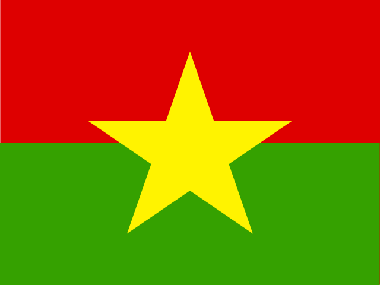 | Burkina Faso | `BFA` | 24 601 700 | 1 500 000 XTC | 574 190 XTC | **2 074 190 XTC** |
|  | Burundi | `BDI` | 14 729 157 | 1 500 000 XTC | 444 285 XTC | **1 944 285 XTC** |
|  | Cabo Verde | `CPV` | 529 630 | 1 500 000 XTC | 84 248 XTC | **1 584 248 XTC** |
|  | Cambodia | `KHM` | 18 051 219 | 1 500 000 XTC | 491 843 XTC | **1 991 843 XTC** |
|  | Cameroon | `CMR` | 30 640 817 | 1 500 000 XTC | 640 801 XTC | **2 140 801 XTC** |
|  | Canada | `CAN` | 40 467 728 | 1 500 000 XTC | 736 423 XTC | **2 236 423 XTC** |
| 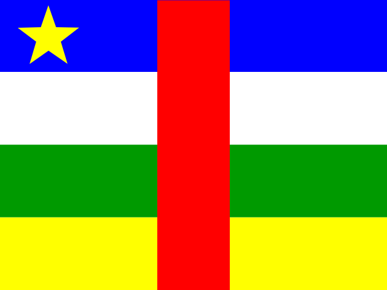 | Central African Republic | `CAF` | 5 698 984 | 1 500 000 XTC | 276 358 XTC | **1 776 358 XTC** |
|  | Chad | `TCD` | 21 560 380 | 1 500 000 XTC | 537 528 XTC | **2 037 528 XTC** |
|  | Chile | `CHL` | 19 945 850 | 1 500 000 XTC | 517 011 XTC | **2 017 011 XTC** |
|  | China | `CHN` | 1 444 027 171 | 1 500 000 XTC | 4 399 069 XTC | **5 899 069 XTC** |
| 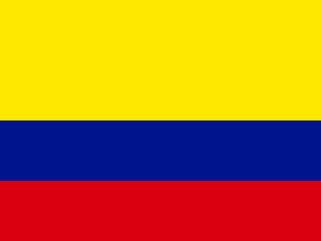 | Colombia | `COL` | 53 936 226 | 1 500 000 XTC | 850 185 XTC | **2 350 185 XTC** |
| 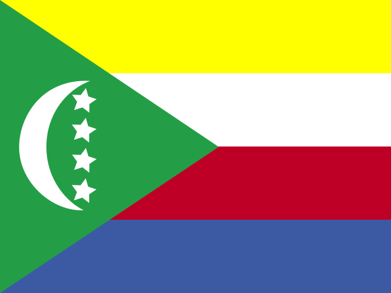 | Comoros | `COM` | 899 010 | 1 500 000 XTC | 109 763 XTC | **1 609 763 XTC** |
| 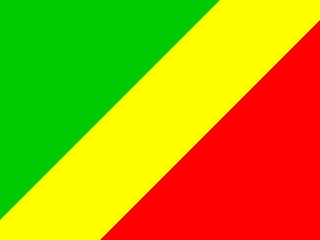 | Congo | `COG` | 6 637 785 | 1 500 000 XTC | 298 253 XTC | **1 798 253 XTC** |
|  | Costa Rica | `CRI` | 5 174 789 | 1 500 000 XTC | 263 342 XTC | **1 763 342 XTC** |
|  | Croatia | `HRV` | 3 822 345 | 1 500 000 XTC | 226 328 XTC | **1 726 328 XTC** |
|  | Cuba | `CUB` | 10 892 659 | 1 500 000 XTC | 382 067 XTC | **1 882 067 XTC** |
| 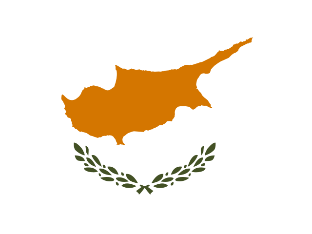 | Cyprus | `CYP` | 1 382 334 | 1 500 000 XTC | 136 107 XTC | **1 636 107 XTC** |
|  | Czechia | `CZE` | 10 527 781 | 1 500 000 XTC | 375 614 XTC | **1 875 614 XTC** |
|  | Côte d'Ivoire | `CIV` | 33 494 346 | 1 500 000 XTC | 669 975 XTC | **2 169 975 XTC** |
|  | Dem. People's Republic of Korea | `PRK` | 26 633 691 | 1 500 000 XTC | 597 432 XTC | **2 097 432 XTC** |
|  | Democratic Republic of the Congo | `COD` | 116 452 162 | 1 500 000 XTC | 1 249 243 XTC | **2 749 243 XTC** |
|  | Denmark | `DNK` | 6 135 675 | 1 500 000 XTC | 286 751 XTC | **1 786 751 XTC** |
| 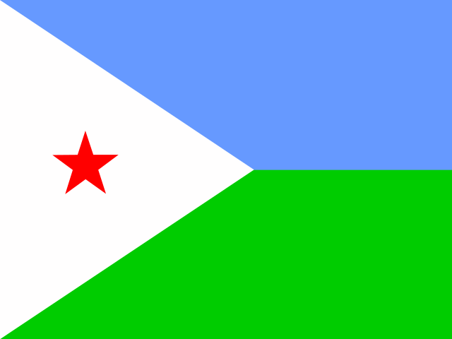 | Djibouti | `DJI` | 1 199 459 | 1 500 000 XTC | 126 784 XTC | **1 626 784 XTC** |
| 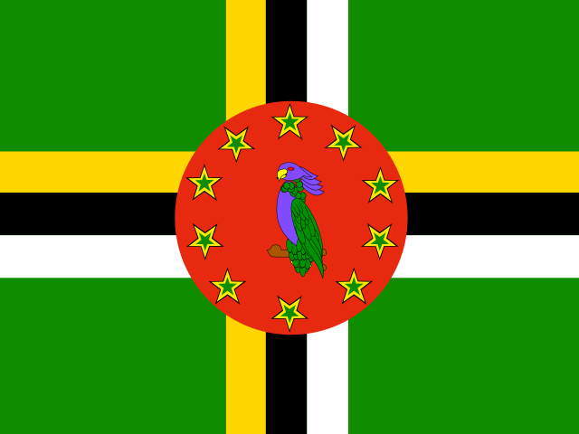 | Dominica | `DMA` | 65 511 | 1 500 000 XTC | 29 630 XTC | **1 529 630 XTC** |
| 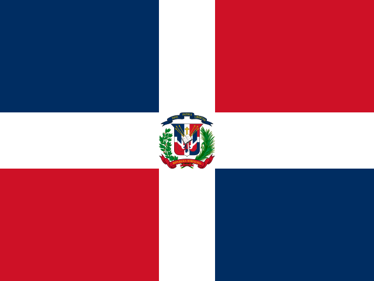 | Dominican Republic | `DOM` | 11 609 500 | 1 500 000 XTC | 394 439 XTC | **1 894 439 XTC** |
| 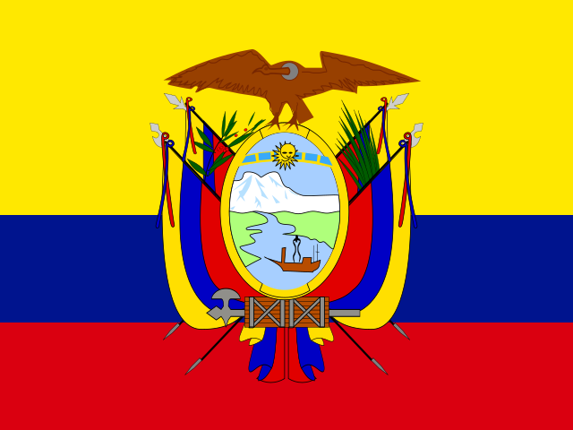 | Ecuador | `ECU` | 18 444 506 | 1 500 000 XTC | 497 172 XTC | **1 997 172 XTC** |
|  | Egypt | `EGY` | 120 101 175 | 1 500 000 XTC | 1 268 664 XTC | **2 768 664 XTC** |
| 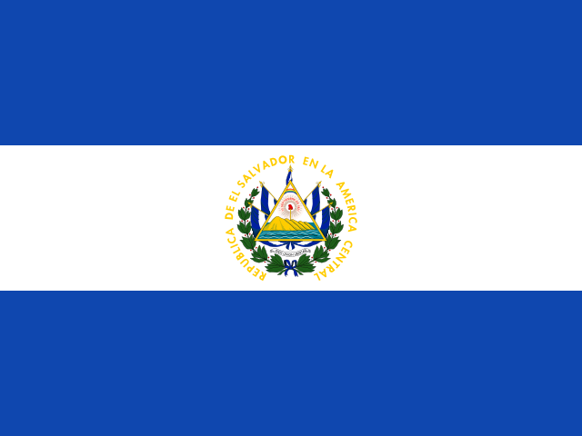 | El Salvador | `SLV` | 6 391 253 | 1 500 000 XTC | 292 662 XTC | **1 792 662 XTC** |
|  | Equatorial Guinea | `GNQ` | 1 984 468 | 1 500 000 XTC | 163 078 XTC | **1 663 078 XTC** |
|  | Eritrea | `ERI` | 3 682 669 | 1 500 000 XTC | 222 154 XTC | **1 722 154 XTC** |
|  | Estonia | `EST` | 1 331 062 | 1 500 000 XTC | 133 559 XTC | **1 633 559 XTC** |
|  | Eswatini | `SWZ` | 1 269 859 | 1 500 000 XTC | 130 452 XTC | **1 630 452 XTC** |
|  | Ethiopia | `ETH` | 138 902 185 | 1 500 000 XTC | 1 364 356 XTC | **2 864 356 XTC** |
|  | Fiji | `FJI` | 937 282 | 1 500 000 XTC | 112 075 XTC | **1 612 075 XTC** |
|  | Finland | `FIN` | 5 621 739 | 1 500 000 XTC | 274 479 XTC | **1 774 479 XTC** |
|  | France | `FRA` | 69 642 313 | 1 500 000 XTC | 966 073 XTC | **2 466 073 XTC** |
|  | Gabon | `GAB` | 2 647 399 | 1 500 000 XTC | 188 357 XTC | **1 688 357 XTC** |
|  | Gambia | `GMB` | 2 884 079 | 1 500 000 XTC | 196 597 XTC | **1 696 597 XTC** |
|  | Georgia | `GEO` | 3 804 642 | 1 500 000 XTC | 225 803 XTC | **1 725 803 XTC** |
|  | Germany | `DEU` | 83 644 258 | 1 500 000 XTC | 1 058 745 XTC | **2 558 745 XTC** |
|  | Ghana | `GHA` | 35 697 557 | 1 500 000 XTC | 691 660 XTC | **2 191 660 XTC** |
|  | Greece | `GRC` | 9 897 115 | 1 500 000 XTC | 364 190 XTC | **1 864 190 XTC** |
| 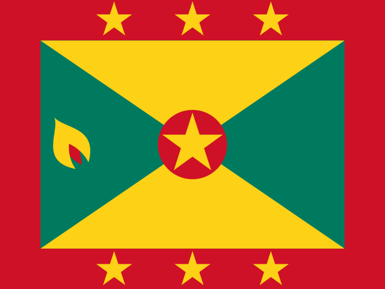 | Grenada | `GRD` | 117 362 | 1 500 000 XTC | 39 659 XTC | **1 539 659 XTC** |
| 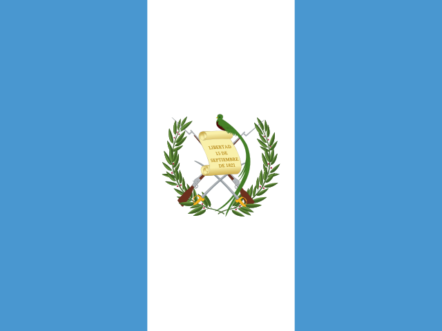 | Guatemala | `GTM` | 18 967 978 | 1 500 000 XTC | 504 178 XTC | **2 004 178 XTC** |
|  | Guinea | `GIN` | 15 441 993 | 1 500 000 XTC | 454 909 XTC | **1 954 909 XTC** |
| 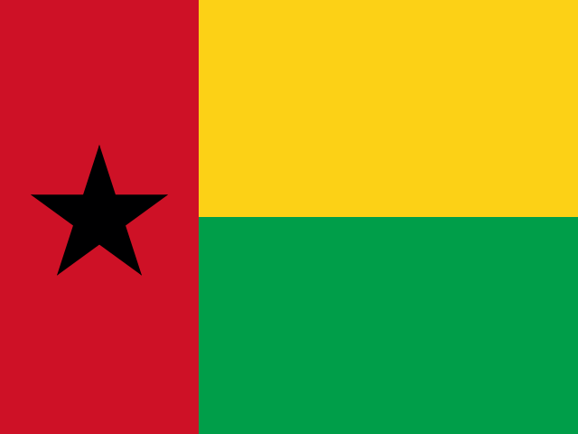 | Guinea-Bissau | `GNB` | 2 297 808 | 1 500 000 XTC | 175 481 XTC | **1 675 481 XTC** |
| 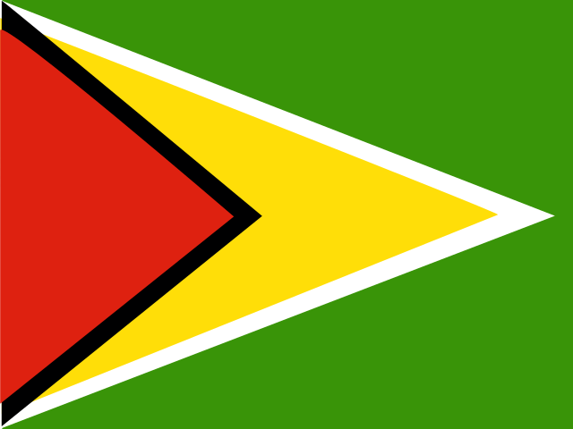 | Guyana | `GUY` | 840 890 | 1 500 000 XTC | 106 156 XTC | **1 606 156 XTC** |
|  | Haiti | `HTI` | 12 037 506 | 1 500 000 XTC | 401 644 XTC | **1 901 644 XTC** |
| 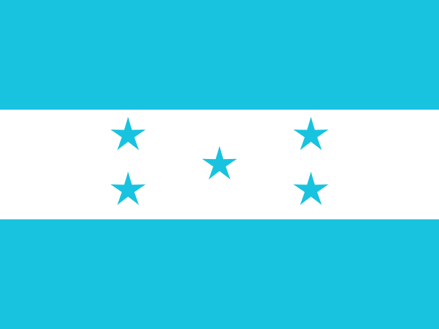 | Honduras | `HND` | 11 184 760 | 1 500 000 XTC | 387 156 XTC | **1 887 156 XTC** |
|  | Hungary | `HUN` | 9 585 818 | 1 500 000 XTC | 358 416 XTC | **1 858 416 XTC** |
|  | Iceland | `ISL` | 402 329 | 1 500 000 XTC | 73 428 XTC | **1 573 428 XTC** |
|  | India | `IND` | 1 476 625 576 | 1 500 000 XTC | 4 448 446 XTC | **5 948 446 XTC** |
|  | Indonesia | `IDN` | 287 886 782 | 1 500 000 XTC | 1 964 192 XTC | **3 464 192 XTC** |
|  | Iran (Islamic Republic of) | `IRN` | 93 168 497 | 1 500 000 XTC | 1 117 397 XTC | **2 617 397 XTC** |
|  | Iraq | `IRQ` | 48 007 437 | 1 500 000 XTC | 802 098 XTC | **2 302 098 XTC** |
|  | Ireland | `IRL` | 5 356 950 | 1 500 000 XTC | 267 937 XTC | **1 767 937 XTC** |
|  | Israel | `ISR` | 9 647 689 | 1 500 000 XTC | 359 571 XTC | **1 859 571 XTC** |
|  | Italy | `ITA` | 58 926 166 | 1 500 000 XTC | 888 643 XTC | **2 388 643 XTC** |
| 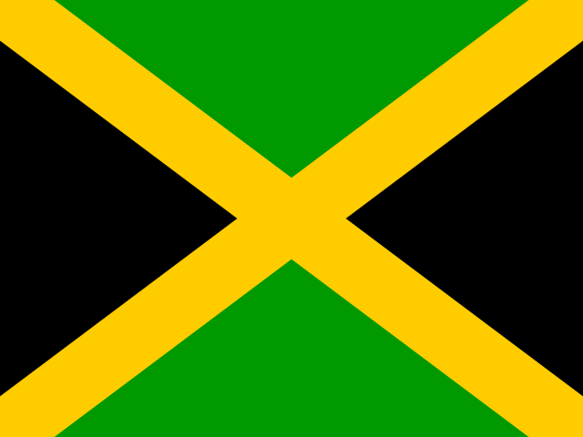 | Jamaica | `JAM` | 2 833 403 | 1 500 000 XTC | 194 862 XTC | **1 694 862 XTC** |
|  | Japan | `JPN` | 122 427 731 | 1 500 000 XTC | 1 280 894 XTC | **2 780 894 XTC** |
|  | Jordan | `JOR` | 11 589 532 | 1 500 000 XTC | 394 100 XTC | **1 894 100 XTC** |
| 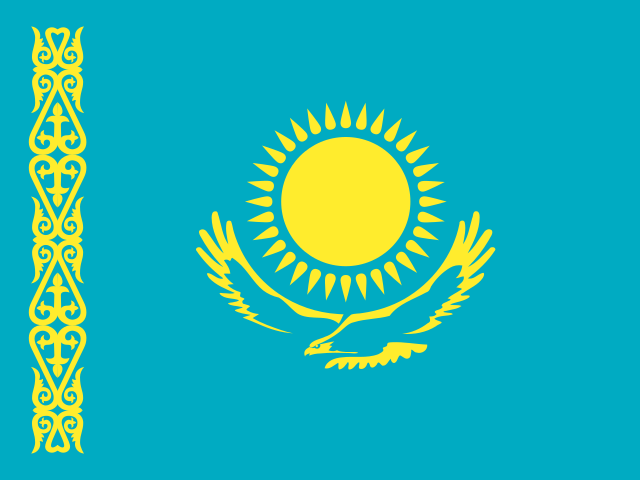 | Kazakhstan | `KAZ` | 21 083 626 | 1 500 000 XTC | 531 552 XTC | **2 031 552 XTC** |
|  | Kenya | `KEN` | 58 636 412 | 1 500 000 XTC | 886 455 XTC | **2 386 455 XTC** |
|  | Kiribati | `KIR` | 138 445 | 1 500 000 XTC | 43 074 XTC | **1 543 074 XTC** |
|  | Kuwait | `KWT` | 5 102 773 | 1 500 000 XTC | 261 503 XTC | **1 761 503 XTC** |
|  | Kyrgyzstan | `KGZ` | 7 400 465 | 1 500 000 XTC | 314 922 XTC | **1 814 922 XTC** |
|  | Lao People's Democratic Republic | `LAO` | 7 974 017 | 1 500 000 XTC | 326 898 XTC | **1 826 898 XTC** |
|  | Latvia | `LVA` | 1 835 935 | 1 500 000 XTC | 156 856 XTC | **1 656 856 XTC** |
|  | Lebanon | `LBN` | 5 897 467 | 1 500 000 XTC | 281 129 XTC | **1 781 129 XTC** |
|  | Lesotho | `LSO` | 2 389 336 | 1 500 000 XTC | 178 942 XTC | **1 678 942 XTC** |
|  | Liberia | `LBR` | 5 853 949 | 1 500 000 XTC | 280 090 XTC | **1 780 090 XTC** |
|  | Libya | `LBY` | 7 539 851 | 1 500 000 XTC | 317 874 XTC | **1 817 874 XTC** |
|  | Liechtenstein | `LIE` | 40 368 | 1 500 000 XTC | 23 259 XTC | **1 523 259 XTC** |
|  | Lithuania | `LTU` | 2 797 338 | 1 500 000 XTC | 193 618 XTC | **1 693 618 XTC** |
|  | Luxembourg | `LUX` | 687 448 | 1 500 000 XTC | 95 983 XTC | **1 595 983 XTC** |
| 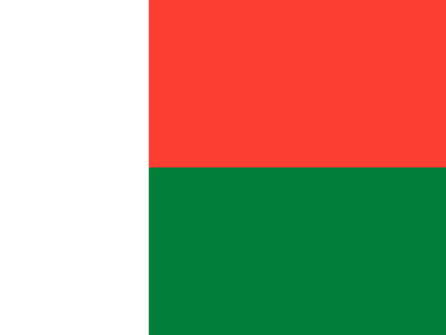 | Madagascar | `MDG` | 33 522 052 | 1 500 000 XTC | 670 252 XTC | **2 170 252 XTC** |
|  | Malawi | `MWI` | 22 785 535 | 1 500 000 XTC | 552 590 XTC | **2 052 590 XTC** |
|  | Malaysia | `MYS` | 36 385 115 | 1 500 000 XTC | 698 289 XTC | **2 198 289 XTC** |
|  | Maldives | `MDV` | 531 517 | 1 500 000 XTC | 84 398 XTC | **1 584 398 XTC** |
|  | Mali | `MLI` | 25 932 275 | 1 500 000 XTC | 589 513 XTC | **2 089 513 XTC** |
| 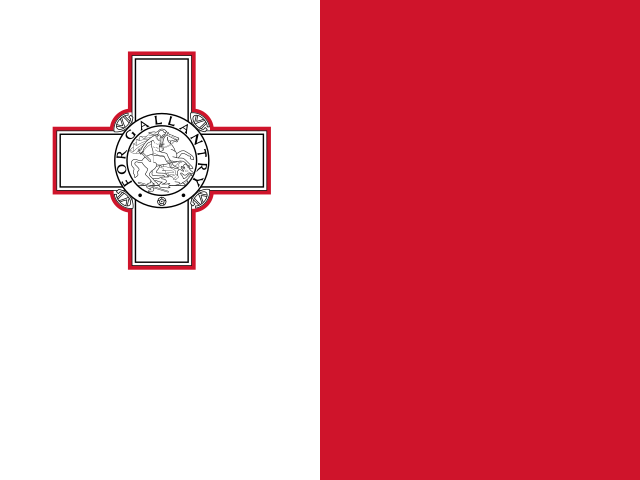 | Malta | `MLT` | 549 011 | 1 500 000 XTC | 85 776 XTC | **1 585 776 XTC** |
|  | Marshall Islands | `MHL` | 35 075 | 1 500 000 XTC | 21 681 XTC | **1 521 681 XTC** |
|  | Mauritania | `MRT` | 5 461 319 | 1 500 000 XTC | 270 534 XTC | **1 770 534 XTC** |
|  | Mauritius | `MUS` | 1 265 059 | 1 500 000 XTC | 130 205 XTC | **1 630 205 XTC** |
| 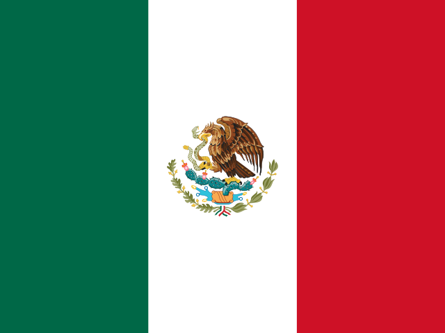 | Mexico | `MEX` | 132 997 658 | 1 500 000 XTC | 1 335 043 XTC | **2 835 043 XTC** |
|  | Micronesia (Fed. States of) | `FSM` | 114 183 | 1 500 000 XTC | 39 118 XTC | **1 539 118 XTC** |
|  | Monaco | `MCO` | 38 087 | 1 500 000 XTC | 22 592 XTC | **1 522 592 XTC** |
|  | Mongolia | `MNG` | 3 556 798 | 1 500 000 XTC | 218 325 XTC | **1 718 325 XTC** |
| 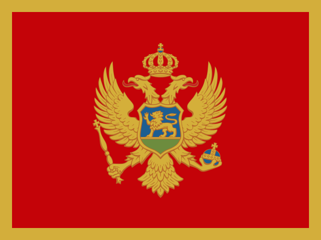 | Montenegro | `MNE` | 626 233 | 1 500 000 XTC | 91 610 XTC | **1 591 610 XTC** |
|  | Morocco | `MAR` | 38 762 441 | 1 500 000 XTC | 720 740 XTC | **2 220 740 XTC** |
|  | Mozambique | `MOZ` | 36 639 851 | 1 500 000 XTC | 700 729 XTC | **2 200 729 XTC** |
|  | Myanmar | `MMR` | 55 184 819 | 1 500 000 XTC | 859 969 XTC | **2 359 969 XTC** |
| 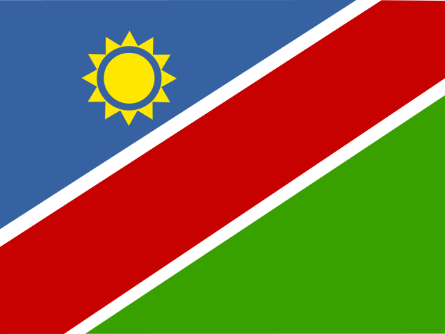 | Namibia | `NAM` | 3 153 246 | 1 500 000 XTC | 205 566 XTC | **1 705 566 XTC** |
|  | Nauru | `NRU` | 12 101 | 1 500 000 XTC | 12 735 XTC | **1 512 735 XTC** |
| 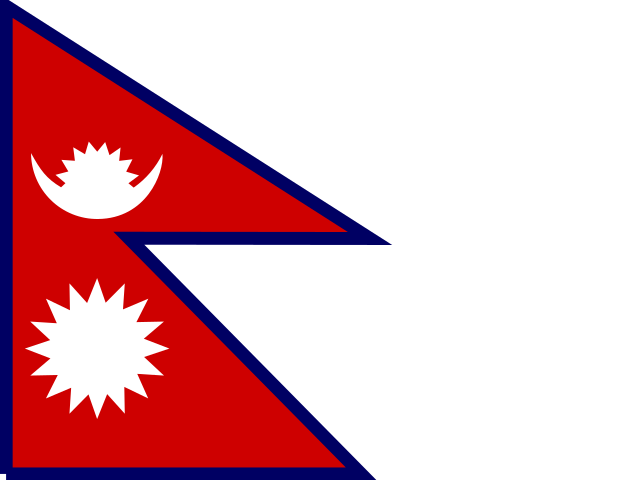 | Nepal | `NPL` | 29 629 410 | 1 500 000 XTC | 630 136 XTC | **2 130 136 XTC** |
|  | Netherlands | `NLD` | 18 818 739 | 1 500 000 XTC | 502 190 XTC | **2 002 190 XTC** |
|  | New Zealand | `NZL` | 5 290 170 | 1 500 000 XTC | 266 261 XTC | **1 766 261 XTC** |
| 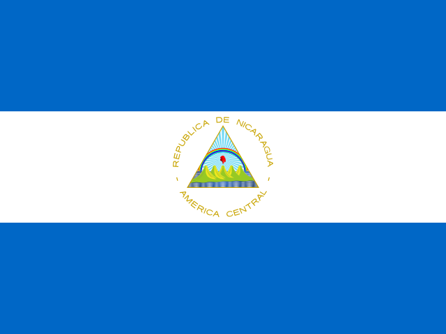 | Nicaragua | `NIC` | 7 097 329 | 1 500 000 XTC | 308 404 XTC | **1 808 404 XTC** |
|  | Niger | `NER` | 28 814 878 | 1 500 000 XTC | 621 415 XTC | **2 121 415 XTC** |
|  | Nigeria | `NGA` | 242 431 832 | 1 500 000 XTC | 1 802 470 XTC | **3 302 470 XTC** |
|  | North Macedonia | `MKD` | 1 804 063 | 1 500 000 XTC | 155 489 XTC | **1 655 489 XTC** |
|  | Norway | `NOR` | 5 652 989 | 1 500 000 XTC | 275 240 XTC | **1 775 240 XTC** |
|  | Oman | `OMN` | 5 671 458 | 1 500 000 XTC | 275 690 XTC | **1 775 690 XTC** |
|  | Pakistan | `PAK` | 259 299 791 | 1 500 000 XTC | 1 864 122 XTC | **3 364 122 XTC** |
|  | Palau | `PLW` | 17 614 | 1 500 000 XTC | 15 364 XTC | **1 515 364 XTC** |
| 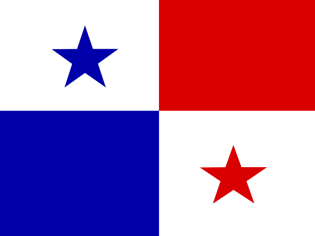 | Panama | `PAN` | 4 625 718 | 1 500 000 XTC | 248 979 XTC | **1 748 979 XTC** |
|  | Papua New Guinea | `PNG` | 10 947 848 | 1 500 000 XTC | 383 034 XTC | **1 883 034 XTC** |
| 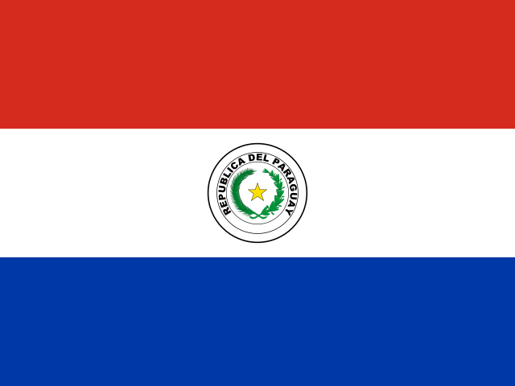 | Paraguay | `PRY` | 7 095 279 | 1 500 000 XTC | 308 360 XTC | **1 808 360 XTC** |
| 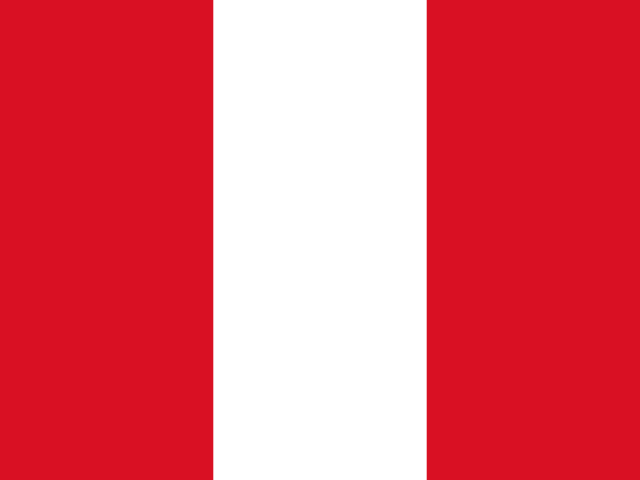 | Peru | `PER` | 34 922 148 | 1 500 000 XTC | 684 106 XTC | **2 184 106 XTC** |
|  | Philippines | `PHL` | 117 724 471 | 1 500 000 XTC | 1 256 049 XTC | **2 756 049 XTC** |
|  | Poland | `POL` | 37 843 188 | 1 500 000 XTC | 712 143 XTC | **2 212 143 XTC** |
|  | Portugal | `PRT` | 10 395 362 | 1 500 000 XTC | 373 244 XTC | **1 873 244 XTC** |
|  | Qatar | `QAT` | 3 173 559 | 1 500 000 XTC | 206 227 XTC | **1 706 227 XTC** |
|  | Republic of Korea | `KOR` | 51 600 388 | 1 500 000 XTC | 831 572 XTC | **2 331 572 XTC** |
| 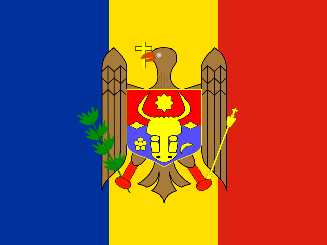 | Republic of Moldova | `MDA` | 2 961 253 | 1 500 000 XTC | 199 210 XTC | **1 699 210 XTC** |
|  | Romania | `ROU` | 18 800 605 | 1 500 000 XTC | 501 948 XTC | **2 001 948 XTC** |
|  | Russian Federation | `RUS` | 143 394 458 | 1 500 000 XTC | 1 386 243 XTC | **2 886 243 XTC** |
|  | Rwanda | `RWA` | 14 889 693 | 1 500 000 XTC | 446 700 XTC | **1 946 700 XTC** |
|  | Saint Kitts and Nevis | `KNA` | 46 992 | 1 500 000 XTC | 25 095 XTC | **1 525 095 XTC** |
|  | Saint Lucia | `LCA` | 180 488 | 1 500 000 XTC | 49 181 XTC | **1 549 181 XTC** |
|  | Saint Vincent and the Grenadines | `VCT` | 99 245 | 1 500 000 XTC | 36 469 XTC | **1 536 469 XTC** |
| 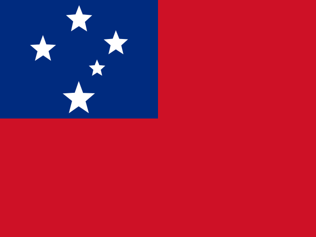 | Samoa | `WSM` | 220 528 | 1 500 000 XTC | 54 363 XTC | **1 554 363 XTC** |
| 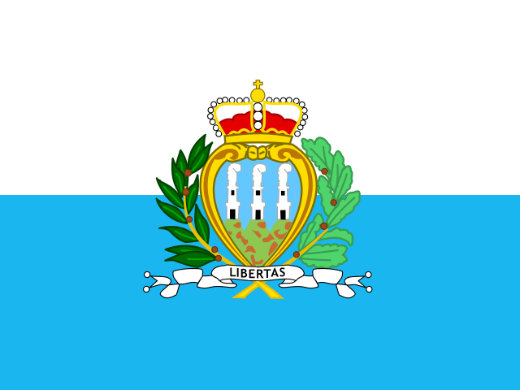 | San Marino | `SMR` | 33 605 | 1 500 000 XTC | 21 221 XTC | **1 521 221 XTC** |
|  | Sao Tome and Principe | `STP` | 244 994 | 1 500 000 XTC | 57 299 XTC | **1 557 299 XTC** |
|  | Saudi Arabia | `SAU` | 35 165 787 | 1 500 000 XTC | 686 489 XTC | **2 186 489 XTC** |
|  | Senegal | `SEN` | 19 366 548 | 1 500 000 XTC | 509 447 XTC | **2 009 447 XTC** |
|  | Serbia | `SRB` | 8 308 956 | 1 500 000 XTC | 333 692 XTC | **1 833 692 XTC** |
|  | Seychelles | `SYC` | 134 959 | 1 500 000 XTC | 42 528 XTC | **1 542 528 XTC** |
|  | Sierra Leone | `SLE` | 8 996 745 | 1 500 000 XTC | 347 229 XTC | **1 847 229 XTC** |
|  | Singapore | `SGP` | 5 905 748 | 1 500 000 XTC | 281 326 XTC | **1 781 326 XTC** |
|  | Slovakia | `SVK` | 5 451 342 | 1 500 000 XTC | 270 287 XTC | **1 770 287 XTC** |
| 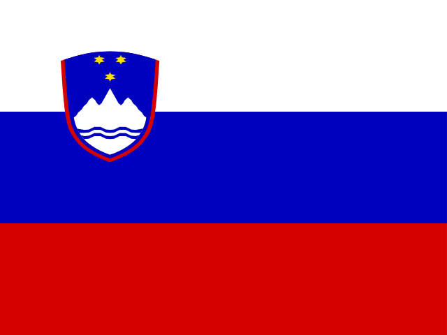 | Slovenia | `SVN` | 2 114 573 | 1 500 000 XTC | 168 339 XTC | **1 668 339 XTC** |
|  | Solomon Islands | `SLB` | 858 288 | 1 500 000 XTC | 107 248 XTC | **1 607 248 XTC** |
|  | Somalia | `SOM` | 20 305 907 | 1 500 000 XTC | 521 656 XTC | **2 021 656 XTC** |
|  | South Africa | `ZAF` | 65 453 084 | 1 500 000 XTC | 936 566 XTC | **2 436 566 XTC** |
|  | South Sudan | `SSD` | 12 436 037 | 1 500 000 XTC | 408 239 XTC | **1 908 239 XTC** |
|  | Spain | `ESP` | 47 850 793 | 1 500 000 XTC | 800 788 XTC | **2 300 788 XTC** |
|  | Sri Lanka | `LKA` | 23 348 315 | 1 500 000 XTC | 559 372 XTC | **2 059 372 XTC** |
|  | Sudan | `SDN` | 53 282 719 | 1 500 000 XTC | 845 019 XTC | **2 345 019 XTC** |
| 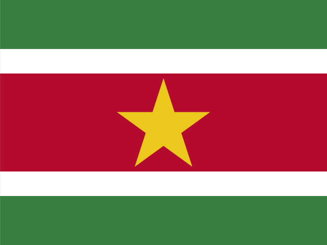 | Suriname | `SUR` | 645 256 | 1 500 000 XTC | 92 991 XTC | **1 592 991 XTC** |
|  | Sweden | `SWE` | 10 701 047 | 1 500 000 XTC | 378 692 XTC | **1 878 692 XTC** |
|  | Switzerland | `CHE` | 9 007 798 | 1 500 000 XTC | 347 442 XTC | **1 847 442 XTC** |
|  | Syrian Arab Republic | `SYR` | 26 472 497 | 1 500 000 XTC | 595 622 XTC | **2 095 622 XTC** |
|  | Tajikistan | `TJK` | 10 978 599 | 1 500 000 XTC | 383 572 XTC | **1 883 572 XTC** |
|  | Thailand | `THA` | 71 559 614 | 1 500 000 XTC | 979 281 XTC | **2 479 281 XTC** |
|  | Timor-Leste | `TLS` | 1 436 923 | 1 500 000 XTC | 138 768 XTC | **1 638 768 XTC** |
|  | Togo | `TGO` | 9 930 918 | 1 500 000 XTC | 364 811 XTC | **1 864 811 XTC** |
|  | Tonga | `TON` | 103 291 | 1 500 000 XTC | 37 205 XTC | **1 537 205 XTC** |
|  | Trinidad and Tobago | `TTO` | 1 513 268 | 1 500 000 XTC | 142 407 XTC | **1 642 407 XTC** |
|  | Tunisia | `TUN` | 12 415 138 | 1 500 000 XTC | 407 895 XTC | **1 907 895 XTC** |
|  | Turkmenistan | `TKM` | 7 736 632 | 1 500 000 XTC | 321 995 XTC | **1 821 995 XTC** |
|  | Tuvalu | `TUV` | 9 362 | 1 500 000 XTC | 11 201 XTC | **1 511 201 XTC** |
|  | Türkiye | `TUR` | 87 926 082 | 1 500 000 XTC | 1 085 505 XTC | **2 585 505 XTC** |
|  | Uganda | `UGA` | 52 761 469 | 1 500 000 XTC | 840 875 XTC | **2 340 875 XTC** |
|  | Ukraine | `UKR` | 39 535 849 | 1 500 000 XTC | 727 895 XTC | **2 227 895 XTC** |
|  | United Arab Emirates | `ARE` | 11 574 682 | 1 500 000 XTC | 393 847 XTC | **1 893 847 XTC** |
|  | United Kingdom | `GBR` | 70 481 661 | 1 500 000 XTC | 971 877 XTC | **2 471 877 XTC** |
|  | United Republic of Tanzania | `TZA` | 72 563 780 | 1 500 000 XTC | 986 128 XTC | **2 486 128 XTC** |
|  | United States of America | `USA` | 352 600 000 | 1 500 000 XTC | 2 173 773 XTC | **3 673 773 XTC** |
| 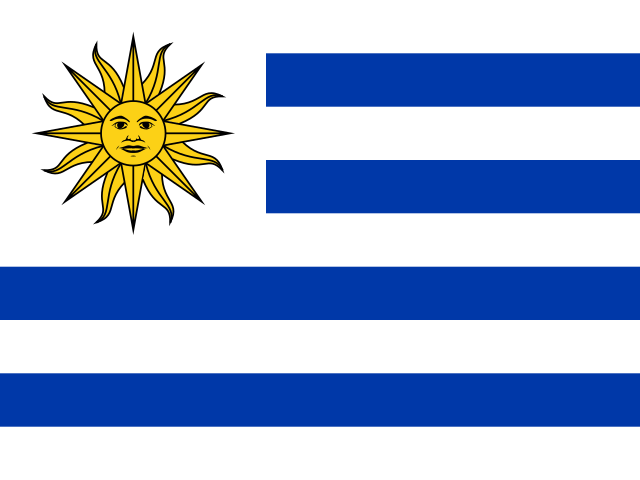 | Uruguay | `URY` | 3 382 537 | 1 500 000 XTC | 212 909 XTC | **1 712 909 XTC** |
| 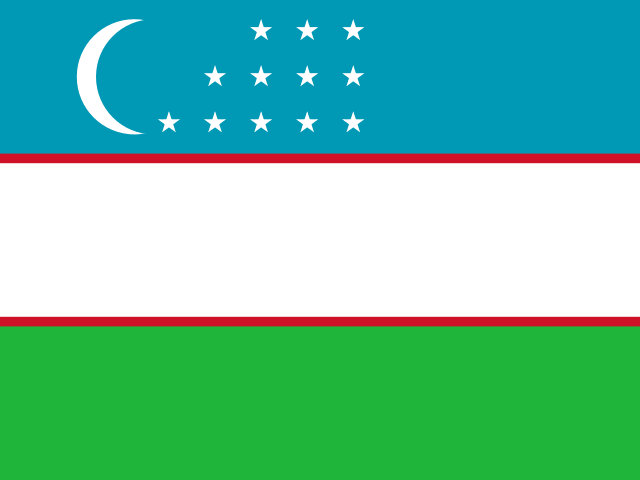 | Uzbekistan | `UZB` | 37 724 223 | 1 500 000 XTC | 711 022 XTC | **2 211 022 XTC** |
|  | Vanuatu | `VUT` | 342 564 | 1 500 000 XTC | 67 755 XTC | **1 567 755 XTC** |
| 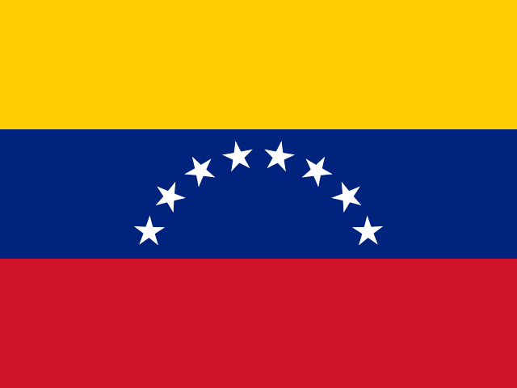 | Venezuela (Bolivarian Republic of) | `VEN` | 28 633 711 | 1 500 000 XTC | 619 458 XTC | **2 119 458 XTC** |
|  | Viet Nam | `VNM` | 102 177 431 | 1 500 000 XTC | 1 170 174 XTC | **2 670 174 XTC** |
|  | Yemen | `YEM` | 42 961 653 | 1 500 000 XTC | 758 776 XTC | **2 258 776 XTC** |
|  | Zambia | `ZMB` | 22 521 915 | 1 500 000 XTC | 549 384 XTC | **2 049 384 XTC** |
|  | Zimbabwe | `ZWE` | 17 273 580 | 1 500 000 XTC | 481 132 XTC | **1 981 132 XTC** |

## Reserved sovereign validator participation

The reference quantity is a finite protocol-funded contribution supporting an activated sovereign validator position. It is not an automatic validator right, an immediate distribution or a substitute for the validator's own commitment.

Before activation, the relevant State must independently satisfy:

1. verified institutional identity and authority;
2. a valid institutional governance mandate;
3. an authorized operating team;
4. legal, security, custody and infrastructure review;
5. at least **5,000,000 XTC** of State-provided self-delegation;
6. explicit approval by the canonical validator-admission authority.

The sovereign allocation cannot be counted toward the five-million-XTC activation minimum.

## Activation-based five-year allocation

Each position receives an individual five-year vesting schedule when it is activated. A position may join years or decades after network launch without requiring a new global calendar or a recurring company transaction.

The allocation accrues linearly through deterministic on-chain accounting during eligible service. For position $i$ at block $b$:

$V_i(b) = A_i \times \frac{\min\left(E_i(b), B_{5y}\right)}{B_{5y}}$

$C_i(b) = V_i(b) - R_i(b)$

Where $A_i$ is the fixed reference allocation, $E_i(b)$ is eligible service measured in blocks, $B_{5y}$ is the configured five-year service duration in blocks, $V_i(b)$ is vested allocation, $R_i(b)$ is allocation already released and $C_i(b)$ is claimable allocation.

The authorized institutional controller may claim the accrued amount at any time. An unclaimed amount remains recorded as claimable.

If the position no longer satisfies the applicable institutional, staking, availability or security conditions, future accrual pauses. Reactivation resumes the schedule without retroactive accrual for the suspended interval. An amount already vested cannot be removed arbitrarily.

The reserve is fixed at 386,000,000 XTC. This release does not create new supply.

## Institutional continuity

Each position remains attached to the relevant State. It is not attached permanently to a president, minister, administration, individual signatory or infrastructure provider.

Successive administrations of the same State may transfer the institutional governance and operating mandate to their authorized successors without replacing the State position, its history or its remaining allocation.

A mandate transition may update the responsible representatives, mandatary, operator and payment instructions. The former team loses its authority when its mandate expires or is revoked. The State position continues under the authorized successor.

Buying tokens from a State or former operator does not grant control of the State position.

## Ordinary validator rights

Sovereign allocation and ordinary validator rewards are separate.

An activated sovereign validator participates under the same ordinary staking, commission, delegation, fee-distribution and slashing rules as other eligible validators. The sovereign position receives its finite allocation over five years while also participating in ordinary network rewards.

After five years of eligible service have fully vested, no further sovereign allocation is created. The position may continue validating and receiving ordinary network rewards while it remains eligible.

## How an institutional review begins

A public authority or formally authorized representative may initiate a review through the [institutional contact pathway](../start/official-links.md).

The first contact creates a case reference only. Before any application is accepted, Xitcoin independently verifies the public institution, official-domain contact, authority of the representative and operating mandate through separate official sources and a secure communication channel.

Personal email, social-media identity or submitted documentation alone never proves governmental authority. No credentials, private keys or confidential identity documents should be sent through social media.

No position activates automatically. Activation requires verified institutional authority, the five-million-XTC self-delegation, operational review and explicit on-chain admission.

## Validator-capacity governance

The target network capacity remains **258 validator positions**: 193 reserved
Member-State positions and 65 general validator positions.

An approved increase in the reserved category reduces the general category by
the same number of positions. An approved decrease increases the general
category by the same number. Changing the total capacity requires a separate
on-chain governance decision.

Registry changes require an objective change in United Nations membership and
an explicit governance proposal. No change may create tokens, rewrite vested
allocations or reduce accrued rights. A new allocation must identify an
available, unallocated funding source.

## Current boundary

The sovereign position registry, institutional succession controls and activation-based vesting mechanism are under development and are not deployed. No application, position or allocation is active at this stage.

## Methodological scope and legal neutrality

For reproducibility, the reserved registry follows the 193 United Nations Member States recorded at the reference date. Xitcoin applies that external membership list as an objective technical criterion and does not create a separate diplomatic classification.

A future membership change does not modify the registry automatically. It requires an on-chain governance proposal, objective supporting evidence and the capacity and funding controls defined by the protocol. The process cannot create supply, rewrite vested allocations or reduce accrued rights.

The complete allocation data and technical verification sources are maintained in the Xitcoin blockchain repository:

- `docs/sovereign-allocation-2026.md`;
- `docs/sovereign-validator-framework.md`;
- `networks/testnet/sovereign-allocation-index-2026.csv`;
- `networks/testnet/sovereign-allocation-index-2026.json`;
- `networks/testnet/territorial-consolidation-2026.csv`;
- `scripts/verify-sovereign-allocation-2026.py`.
