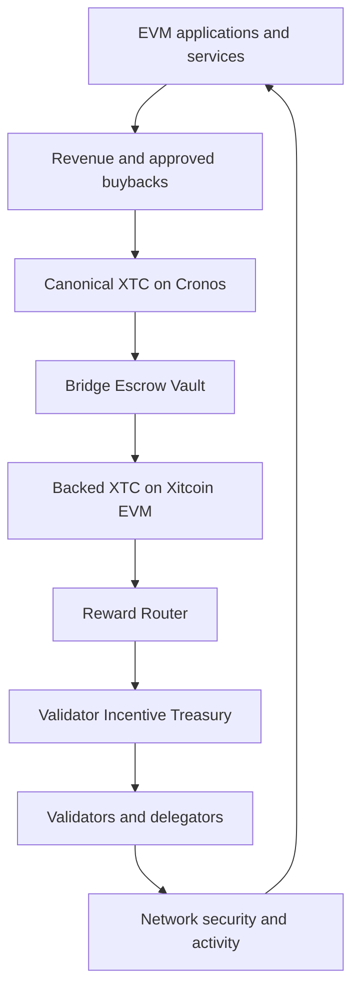

# Validator incentives and revenue flywheel

Xitcoin is designed to combine native staking, EVM application activity and cross-chain revenue sources without relying on unrestricted inflation.

This page describes a **planned architecture**. It does not state that the treasury, bridge contracts or reward router are already active.

## Verified testnet reference

The following parameters were verified on the coordinated candidate testnet on **19 August 2026**:

| Parameter | Verified value |
|---|---:|
| Current bonded stake | 20,000,000 XTC |
| Initial validators | 4 |
| Stake per initial validator | 5,000,000 XTC |
| Protocol inflation | 0% |
| Community tax | 2% |
| Maximum validator capacity | 258 |
| Candidate unbonding period | 21 days |
| Native precision | 18 decimals |

The four initial validators are Xitcoin Atlas, Xitcoin Borealis, Xitcoin Meridian and Xitcoin Zenith.

## Planned incentive policy

The mainnet planning reference separates validator stake from the reward treasury.

| Planning parameter | Reference |
|---|---:|
| Initial Validator Incentive Treasury planning reference | 100,000,000 XTC |
| Initial operating APR target | 8% of eligible bonded stake |
| Governance-adjustable funded APR range | 0% to 20% |
| Absolute annual token cap | None independent of bonded stake |
| Unrestricted mint authority | None |

The funded reward calculation is:

```
annual funded rewards =
min(
  active APR × eligible bonded XTC,
  annual budget already funded and committed,
  available Validator Incentive Treasury balance
)
```

The available treasury balance is always a hard limit. If the treasury is empty, treasury-funded distributions stop.

Transaction fees and other protocol revenues remain subject to the network's active distribution parameters. Availability, validator commission, delegation and slashing can change the amount received by each participant.

## Parameter governance and flexibility

The planning values are configurable operating parameters, not a promise of a permanent fixed yield.

Subject to the final module implementation and its on-chain authority:

- the initial operating APR target is **8%**;
- the funded APR may be adjusted between **0% and 20%**;
- no fixed annual token ceiling is imposed independently of eligible bonded stake;
- the next reward period must be funded before its activation;
- an APR increase is limited to one percentage point per quarter;
- distributions may be paused without moving or destroying the funded treasury balance;
- new funding may increase a future funded APR or extend the operating horizon;
- funding a vault never changes a parameter by itself.

A valid on-chain parameter decision may change the operating APR within these safety limits. Exceeding 20%, granting mint authority or bypassing pre-funding requires a separately reviewed protocol upgrade.

Reward-policy decisions remain separate from validator admission. A reward-parameter vote does not approve, protect or revoke a validator.

## Cross-chain revenue flywheel



The purpose of this loop is to allow application activity to strengthen network security over time. Ecosystem companies, integration partners and independent developers may design applications that contribute through transparent buyback, revenue-sharing or network-fee mechanisms.

Contributions may support a higher future funded APR or extend the treasury's operating horizon. They never change the active APR automatically. A funded deposit alone grants no parameter authority.

## Separation of responsibilities

The architecture uses separate components:

1. **Revenue Collector** — receives the share of application revenue assigned by the contributing application.
2. **Bridge Escrow Vault** — locks canonical Cronos XTC used as backing.
3. **Reward Router** — routes verified, backed XTC from the EVM environment to the native reward layer.
4. **Validator Incentive Treasury** — holds available native XTC and releases it under protocol limits.
5. **Cosmos distribution layer** — accounts for validator commission, delegator rewards and applicable penalties.

The Bridge Escrow Vault and Validator Incentive Treasury are not the same account. Backing must not be counted as freely distributable funds until the corresponding cross-chain operation is complete.

## Vault control model

The native Validator Incentive Treasury is planned as a Cosmos module account. It has no private key or seed and cannot be operated like a personal wallet. Releases are executed only by deterministic module rules.

Cross-chain vault and router administration must not depend on a single externally owned account. Production controls require separated roles, multisignature authorization, a timelock for non-emergency changes, replay protection, observable events and an emergency pause that stops operations without granting seizure authority.

Funding a vault does not confer control over it. Relayers may submit verified messages but must not receive arbitrary withdrawal, upgrade or mint permissions.

## Mint-authority boundary

The bridge and the reward module have different authorities:

- the authorized Xitcoin bridge module may mint native XTC only after verifying an equivalent finalized lock of canonical XTC on Cronos;
- returning to Cronos burns the corresponding bridge-minted XTC before unlocking the original Cronos XTC;
- the Validator Incentive Treasury has no mint authority and distributes only funded XTC already credited to it;
- applications, relayers, validators and vault depositors have no arbitrary mint authority;
- the canonical Cronos XTC contract receives no new mint authority for bridge operation.

A strictly backed bridge mint changes the network representation of XTC without increasing global economic supply.

## Required accounting invariants

At all times:

```
bridge-authorized XTC on Xitcoin
≤ canonical XTC locked on Cronos
```

and:

```
treasury-funded rewards distributed
≤ funded Validator Incentive Treasury balance
```

The planned incentive module must not receive unrestricted mint permission. Treasury funding must come from identifiable XTC deposits or protocol revenues.

## Multichain staking boundary

Xitcoin POS and Xitcoin EVM share the same native XTC economy. They must not create separate balances or duplicate rewards.

- Native consensus staking delegates XTC to approved validators.
- A future Xitcoin EVM interface may call the canonical staking module through an audited precompile or adapter.
- A Cronos application may offer a separately funded yield program, or aggregate native staking by bridging and delegating the underlying XTC.
- A token may participate in only one reward path for the same period.
- XTC merely held or used on Xitcoin EVM is not automatically staked.

The number of validators changes how the funded reward budget is distributed; it does not multiply the aggregate reward budget.

## Participation boundary

New validators provide their own required stake and remain subject to admission review. A sovereign reference allocation does not automatically generate staking rewards.

A participant receives validator or delegator rewards only through active, eligible stake under the live protocol rules.

## Verified implementation progress

The development branch was verified on **20 August 2026** without deployment
or movement of funds.

The verified implementation scope currently includes:

- protocol parameters with an initial 8% operating APR and a hard 20% ceiling;
- a maximum increase of one percentage point per reward period;
- deterministic prefunded reward-period calculation;
- rejection of overlapping periods and distributions outside the active period;
- rejection of distributions exceeding the remaining period provision;
- persistent period state and cumulative distribution accounting;
- a Cosmos module-account treasury with no private key and no mint or burn permission;
- real treasury balances read from the Bank keeper;
- eligible bonded stake read from the Staking keeper;
- rejection of caller-supplied treasury balances or eligible stake;
- accounting updated only after a successful bank transfer;
- governance-module authority for parameter updates and funded-period activation;
- complete Cosmos messages, validation, message server and transaction CLI;
- application store, keeper, module, codec and genesis integration;
- read-only gRPC and REST queries for parameters, period state and treasury balance;
- tests covering invalid authorities, invalid budgets, empty treasuries,
  failed transfers, period limits, application wiring and public query results.

The public read-only paths are:

- `/cosmos/evm/validatorincentives/v1/params`
- `/cosmos/evm/validatorincentives/v1/period`
- `/cosmos/evm/validatorincentives/v1/treasury`

Reward-policy governance remains separate from validator admission. A funded
incentive proposal cannot approve, protect or revoke a validator.

The incentive module never mints bridge assets. Bridge lock/mint and
burn/unlock accounting belongs to the separately controlled bridge subsystem.
The incentive treasury distributes only native XTC already credited to its
module account.

These successful development tests do not constitute a production deployment,
a security audit or evidence that the treasury has been funded.

## Security and release status

Before activation, the system requires:

- deterministic accounting tests;
- funded-APR, solvency and reward-period tests;
- four- and five-validator distribution tests;
- bridge replay and finality protection;
- vault, router and module access controls;
- emergency pause and recovery procedures;
- supply reconciliation across Cronos and Xitcoin;
- independent security review;
- public contract, module and deployment records.


The Validator Incentive Treasury, Reward Router and cross-chain revenue flywheel remain pre-launch components until their code, funding, security controls and deployment records have been validated.

