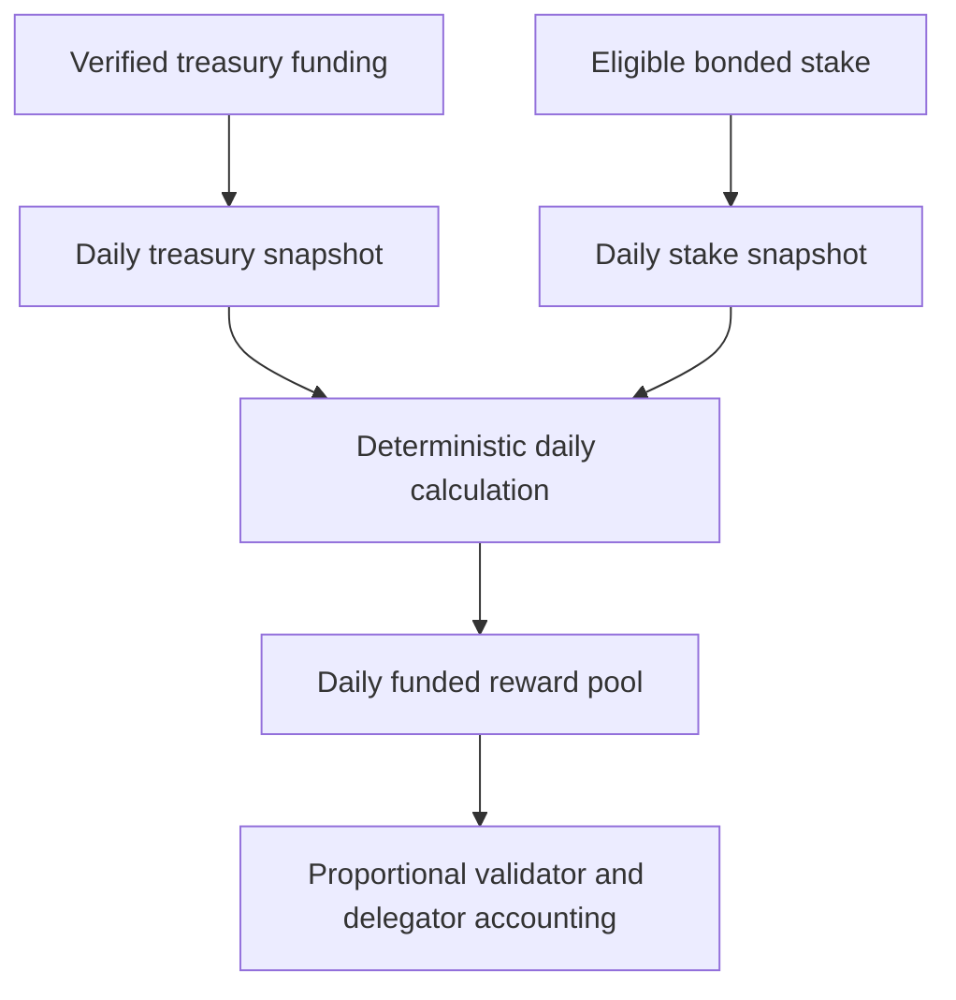
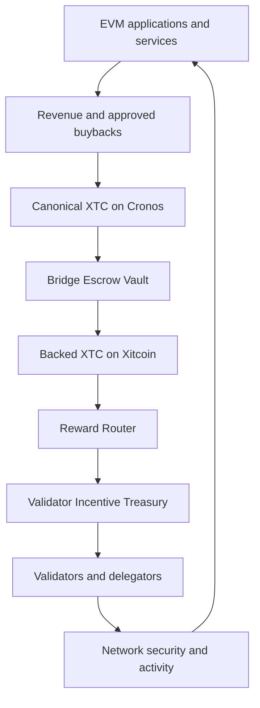

# Validator incentives and revenue flywheel

Xitcoin combines native staking, EVM application activity and funded validator incentives without unrestricted inflation.

This page defines the **pre-launch mainnet economic specification**. It does not state that the mainnet treasury, bridge contracts or reward router are already active.

## Verified testnet reference

The following parameters were verified on the canonical public testnet on **21 August 2026**:

| Parameter | Verified value |
|---|---:|
| Current bonded stake | 20,000,000 XTC |
| Initial validators | 4 |
| Stake per initial validator | 5,000,000 XTC |
| Protocol inflation | 0% |
| Community tax | 2% |
| Maximum validator capacity | 258 |
| Unbonding period | 21 days |
| Native precision | 18 decimals |

The four initial validators are Xitcoin Atlas, Xitcoin Borealis, Xitcoin Meridian and Xitcoin Zenith.

## Mainnet launch reference

The launch plan separates validator stake, funded rewards and operational liquidity.

| Mainnet parameter | Launch reference |
|---|---:|
| Initial eligible bonded stake | 20,000,000 XTC |
| Initial validators | 4 |
| Stake per initial validator | 5,000,000 XTC |
| Initial Validator Incentive Treasury | 20,000,000 XTC |
| Treasury annual release rate | 10% |
| Initial annualized reward capacity | 2,000,000 XTC |
| Reward recalculation | Daily |
| Protocol inflation | 0% |
| Unrestricted mint authority | None |

The 10% value is the treasury's annual release policy. It is **not a promised staking APR**. The displayed APY is derived from the current funded treasury balance and the current eligible bonded stake.

The initial validator stake and the Validator Incentive Treasury are separate balances. Neither balance is part of the sovereign reference reserve.

## How the daily reward calculation works

At each daily calculation boundary, the protocol reads two on-chain values:

1. **Current funded treasury balance** — XTC available to fund validator incentives.
2. **Current eligible bonded stake** — bonded XTC that satisfies the active reward rules.

It then calculates:

```text
annualized reward capacity
= current funded treasury balance × 10%

derived APY
= annualized reward capacity ÷ current eligible bonded stake

daily reward pool
= annualized reward capacity ÷ 365.25

participant daily share
= daily reward pool
  × participant eligible stake
  ÷ total eligible bonded stake
```

The calculation is deterministic and balance-based:

- additional verified funding affects the next daily calculation;
- an increase in eligible bonded stake spreads the daily pool across more stake;
- a decrease in eligible bonded stake concentrates the same daily pool across less stake;
- distributions stop when the funded treasury balance reaches zero;
- no distribution may exceed the available treasury balance;
- the protocol does not accept a manually entered APR.

At the launch reference values, the 20,000,000 XTC treasury produces an initial annualized reward capacity of 2,000,000 XTC. With 20,000,000 eligible bonded XTC, the initial derived APY is 10%. Both values change as the two live balances change.



## What is and is not included

The funded incentive pool is distinct from ordinary chain fee distribution.

- Validator commission and delegator rewards follow the staking and distribution modules.
- Transaction fees follow the active chain distribution parameters.
- Fees increase the funded incentive treasury only when an explicit, reviewed protocol route transfers them there.
- Slashing, eligibility and validator commission can change an individual participant's final receipt.
- Validator admission and reward eligibility remain separate decisions.

A reward calculation does not approve, protect or revoke a validator.

## Cross-chain revenue flywheel



Application revenue, approved buybacks and other reviewed funding sources may replenish the treasury. Once verified funding is credited on-chain, it affects the next daily reward calculation. A deposit grants no governance or withdrawal authority.

## Separation of responsibilities

The architecture uses separate components:

1. **Revenue Collector** — receives the revenue share assigned by a contributing application.
2. **Bridge Escrow Vault** — locks canonical Cronos XTC used as backing.
3. **Reward Router** — routes verified, backed XTC to the native reward layer.
4. **Validator Incentive Treasury** — holds funded native XTC and releases it under deterministic limits.
5. **Cosmos distribution layer** — accounts for validator commission, delegator rewards and applicable penalties.

The Bridge Escrow Vault and Validator Incentive Treasury are not the same account. Locked backing is not distributable treasury funding.

## Vault control model

The native Validator Incentive Treasury is planned as a Cosmos module account. It has no private key or seed and cannot be operated like a personal wallet. Releases are executed only by deterministic module rules.

Cross-chain vault and router administration must use separated roles, threshold authorization, delayed non-emergency changes, replay protection, observable events and a limited emergency pause. Relayers may submit verified messages but cannot receive arbitrary withdrawal, upgrade or mint permissions.

## Mint-authority boundary

The bridge and the reward module have different authorities:

- the authorized Xitcoin bridge module may mint native XTC only after verifying an equivalent finalized lock of canonical XTC on Cronos;
- returning to Cronos burns the corresponding bridge-minted XTC before unlocking the original Cronos XTC;
- the Validator Incentive Treasury has no mint authority and distributes only funded XTC already credited to it;
- applications, relayers, validators and vault depositors have no arbitrary mint authority;
- the canonical Cronos XTC contract receives no new mint authority for bridge operation.

A strictly backed bridge mint changes the network representation of XTC without increasing global economic supply.

## Supply and bridge accounting

The live Cronos contract `totalSupply` is the current canonical supply reference. Confirmed burns reduce that value. It is monitored separately from staking APY.

Bridge accounting must always satisfy:

```text
bridge-authorized XTC on Xitcoin
≤ canonical XTC locked on Cronos
```

Treasury accounting must always satisfy:

```text
cumulative treasury-funded rewards
≤ cumulative verified treasury funding
```

The reward calculation does not use the global XTC supply as its APY denominator. Global supply, burns, bridge locks, bridge mints and bridge releases are reconciled through separate supply controls.

## Multichain staking boundary

Xitcoin POS and Xitcoin EVM share the same native XTC balance and fee economy. They do not create separate native supplies or duplicate rewards.

- Native consensus staking delegates XTC to approved validators.
- An audited Xitcoin EVM interface may call the canonical staking module.
- A Cronos application may aggregate native staking only by completing the verified bridge and delegation path.
- A balance may participate in only one reward path for the same period.
- XTC held or used on Xitcoin EVM is not automatically staked.

The number of validators changes how the funded reward pool is distributed; it does not multiply the aggregate reward pool.

## Participation boundary

New validators provide their required stake and remain subject to admission review. A sovereign reference allocation does not automatically create validator admission or staking rewards.

A participant receives validator or delegator rewards only through active, eligible stake under the live protocol rules.

## Technical specification and verification

Implementation details, governance message formats, test cases and release evidence are maintained with the source code:

- [Xitcoin PoS Chain repository](https://github.com/xitcoin-org/pos-chain)
- [Validator Incentive governance operations](https://github.com/xitcoin-org/pos-chain/blob/main/docs/validator-incentives-governance.md)

The implementation must match this specification before mainnet activation. Activation additionally requires funded on-chain configuration, supply reconciliation, security review and public deployment records.


The Validator Incentive Treasury, Reward Router and cross-chain revenue flywheel remain pre-launch components until their code, funding, security controls and deployment records have been validated.

