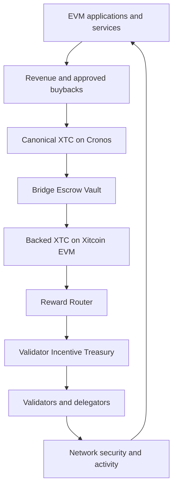

# Validator incentives and revenue flywheel

Xitcoin is designed to combine native staking, EVM application activity and cross-chain revenue sources without relying on unrestricted inflation.

This page describes a **planned architecture**. It does not state that the treasury, bridge contracts or reward router are already active.

## Verified testnet reference

The following parameters were verified on the coordinated candidate testnet on **19 August 2026**:

| Parameter | Verified value |
|---|---:|
| Current bonded stake | 20,000,000 XTC |
| Initial validators | 4 |
| Stake per initial validator | 5,000,000 XTC |
| Protocol inflation | 0% |
| Community tax | 2% |
| Maximum validator capacity | 258 |
| Candidate unbonding period | 21 days |
| Native precision | 18 decimals |

The four initial validators are Xitcoin Atlas, Xitcoin Borealis, Xitcoin Meridian and Xitcoin Zenith.

## Planned incentive policy

The mainnet planning reference separates validator stake from the reward treasury.

| Planning parameter | Reference |
|---|---:|
| Initial Validator Incentive Treasury | 100,000,000 XTC |
| Maximum treasury-funded annual rate | 8% of bonded stake |
| Maximum treasury-funded annual distribution | 10,000,000 XTC |
| Unrestricted mint authority | None |

The planned annual treasury contribution is:

```
annual treasury distribution =
min(8% × total bonded XTC, 10,000,000 XTC)
```

The available treasury balance remains an additional hard limit. If the treasury is empty, treasury-funded distributions stop.

Transaction fees and other protocol revenues remain subject to the network's active distribution parameters. Availability, validator commission, delegation and slashing can change the amount received by each participant.

## Cross-chain revenue flywheel



The purpose of this loop is to allow application activity to strengthen network security over time. Ecosystem companies, integration partners and independent developers may design applications that contribute through transparent buyback, revenue-sharing or network-fee mechanisms.

Contributions extend the treasury's operating horizon. They do not automatically increase the annual distribution ceiling.

## Separation of responsibilities

The architecture uses separate components:

1. **Revenue Collector** — receives the share of application revenue assigned by the contributing application.
2. **Bridge Escrow Vault** — locks canonical Cronos XTC used as backing.
3. **Reward Router** — routes verified, backed XTC from the EVM environment to the native reward layer.
4. **Validator Incentive Treasury** — holds available native XTC and releases it under protocol limits.
5. **Cosmos distribution layer** — accounts for validator commission, delegator rewards and applicable penalties.

The Bridge Escrow Vault and Validator Incentive Treasury are not the same account. Backing must not be counted as freely distributable funds until the corresponding cross-chain operation is complete.

## Required accounting invariants

At all times:

```
bridge-authorized XTC on Xitcoin
≤ canonical XTC locked on Cronos
```

and:

```
treasury-funded rewards distributed
≤ funded Validator Incentive Treasury balance
```

The planned incentive module must not receive unrestricted mint permission. Treasury funding must come from identifiable XTC deposits or protocol revenues.

## Participation boundary

New validators provide their own required stake and remain subject to admission review. A sovereign reference allocation does not automatically generate staking rewards.

A participant receives validator or delegator rewards only through active, eligible stake under the live protocol rules.

## Security and release status

Before activation, the system requires:

- deterministic accounting tests;
- rate and annual-cap tests;
- four- and five-validator distribution tests;
- bridge replay and finality protection;
- vault, router and module access controls;
- emergency pause and recovery procedures;
- supply reconciliation across Cronos and Xitcoin;
- independent security review;
- public contract, module and deployment records.


The Validator Incentive Treasury, Reward Router and cross-chain revenue flywheel remain pre-launch components until their code, funding, security controls and deployment records have been validated.

